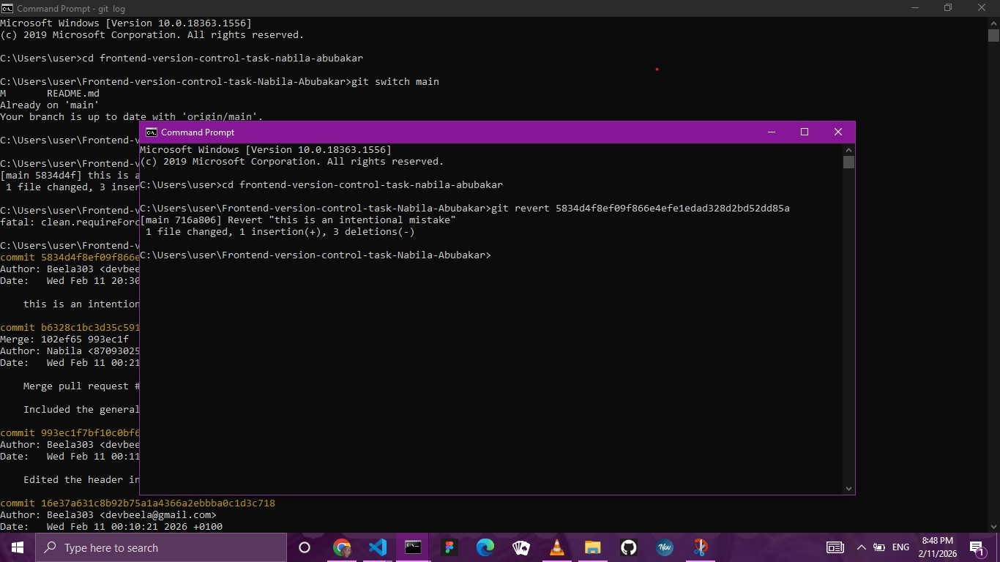
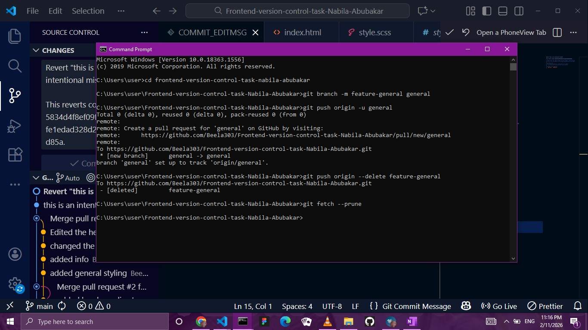

## Welcome to my repository where I show what I've learnt in version control

## Hi! I'm Nabila Abubakar, a Frontend Developer Intern from Flexisaf
### This repo shows:
Branching & Collaboration

Pull Requests 

Merging

Reversion

Cleanup

## BRANCH NAMES
### FEATURE-HEADER:
This branch was made to make the header of the website.

### FEATURE-FOOTER
This is a feature to include the footer which had links to the general website (where I post my weekly tasks) and the github repository.

### GENERAL (Formerly FEATURE-GENERAL)
This is the general customization of the website.

## SCREENSHOT
### MERGED PRs

### REVERT

### RENAME AND FETCH BRANCH

## GIT COMMANDS I FREQUENTLY USED
git add .

git commit -m "message"

git switch branch-name

git push origin branch-name

## LESSONS LEARNED
This was a very interesting exercise which made me refresh my memory on a lot of things and still learned a lot.

I had fun learning how to revert commits which made me look through the logs using git logs and then using the ID to pin-point the exact commit.

Renaming a branch and merging it locally,